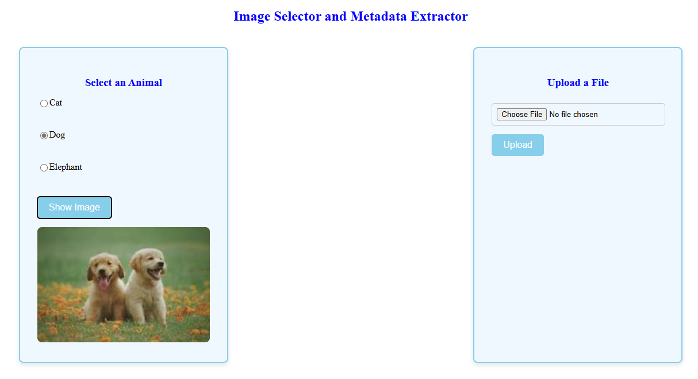

# Basic Flask Image Viewer & File Metadata App

A simple Flask web application that allows users to view animal images and analyze file metadata. The application provides two main functionalities: viewing preset animal images and analyzing uploaded file metadata.

View demo of the application [here](https://www.youtube.com/watch?v=UVVdRRlHyD8)

## Features

### Animal Image Viewer
- Select from three animal options:
  - Cat
  - Dog
  - Elephant
- View corresponding animal images when an option is selected

### File Metadata Analyzer
- Upload any file type
- View detailed metadata information about the uploaded file, including:
  - File name
  - File size
  - File type
  - Creation date
  - Last modified date
  - File permissions

## Installation

1. Clone the repository
2. Create and activate a virtual environment (optional but recommended)
3. Install required dependencies

## Usage

1. Run the application using `python app.py`
2. Access the application through your web browser at `http://127.0.0.1:5000`
3. Use the web interface to view animal images and analyze file metadata

## Project Structure

basic-flask-app/
├── app.py
├── static/
│ └── images/
│ ├── cat.jpg
│ ├── dog.jpg
│ └── elephant.jpg
├── templates/
│ ├── index.html
│ └── metadata.html
└── README.md

## API Endpoints
- `GET /`: Home page with animal selection and file upload options
- `POST /show_image`: Display selected animal image
- `POST /upload`: Handle file upload and display metadata

## Requirements

- Python 3.6+
- Flask
- Web browser with JavaScript enabled