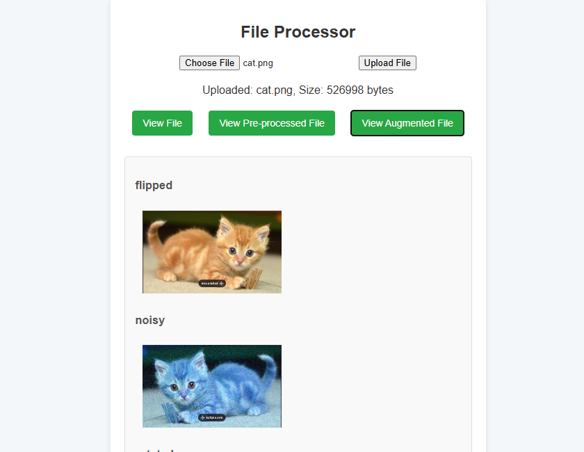

# File Processor Application

A Flask-based web application that allows users to upload, process, and augment different types of files (images, text, and audio). The application provides various preprocessing and augmentation options for each file type.

View demo of the application [here](https://www.youtube.com/watch?v=j0QQ1QIGhco)

## Features

### Image Processing
- Upload image files (supported formats: JPG, PNG, etc.)
- Preprocessing options:
  - Resize
  - Grayscale conversion
  - Noise reduction
  - Color adjustment
- Image augmentation:
  - Rotation
  - Flipping
  - Brightness adjustment
  - Contrast enhancement

### Text Processing
- Upload text files (TXT, CSV, etc.)
- Preprocessing options:
  - Text cleaning
  - Tokenization
  - Stop word removal
  - Lowercase conversion
- Text augmentation:
  - Synonym replacement
  - Back translation
  - Random insertion/deletion

### Audio Processing
- Upload audio files (WAV, MP3, etc.)
- Preprocessing options:
  - Noise reduction
  - Normalization
  - Sample rate conversion
- Audio augmentation:
  - Time stretching
  - Pitch shifting
  - Background noise addition

## Usage

1. Clone the repository
2. Run the application using `python app.py`
3. Access the application through your web browser at `http://127.0.0.1:5000`
4. Use the web interface to:
   - Upload files
   - Select processing options
   - View and download processed results

## API Endpoints

### Image Processing
- `POST /upload/image`: Upload an image file
- `GET /process/image`: Process uploaded image with selected options
- `GET /augment/image`: Apply selected augmentations to image

### Text Processing
- `POST /upload/text`: Upload a text file
- `GET /process/text`: Process uploaded text with selected options
- `GET /augment/text`: Apply selected augmentations to text

### Audio Processing
- `POST /upload/audio`: Upload an audio file
- `GET /process/audio`: Process uploaded audio with selected options
- `GET /augment/audio`: Apply selected augmentations to audio

## Requirements

- Python 3.7+
- Flask
- OpenCV (for image processing)
- NLTK (for text processing)
- Librosa (for audio processing)
- Other dependencies listed in requirements.txt

## Contributing

1. Fork the repository
2. Create a new branch for your feature
3. Commit your changes
4. Push to the branch
5. Create a Pull Request 

