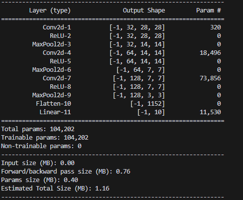

# MNIST CNN Training Visualizer

A web-based interactive tool for training and comparing different CNN configurations on the MNIST dataset. This application allows users to experiment with various hyperparameters and visualize training progress in real-time.

## Model Architecture

The CNN architecture consists of:
- Input layer (MNIST images: 1 channel)
- Three configurable convolutional layers
- Max pooling after each conv layer
- Fully connected output layer (10 classes)

## Features

- **Interactive Web Interface**: Clean, modern UI with configurable parameters
- **Real-time Training Visualization**: Live plots showing training and testing metrics
- **Hyperparameter Tuning**: Easily adjust:
  - Number of epochs
  - Batch size
  - Learning rate
  - Optimizer (Adam/SGD)
  - Model architecture (channel sizes)
- **Multi-run Comparison**: Compare multiple training runs with different configurations
- **Real-time Plotting**: Dynamic visualization of:
  - Training/Testing Loss
  - Testing Accuracy

## Tech Stack

- **Backend**: Python, Flask, Socket.IO
- **Frontend**: HTML, CSS, JavaScript
- **Deep Learning**: PyTorch
- **Visualization**: Plotly.js
- **Dataset**: MNIST

## Project Structure

mnist_cnn/  
├── static/   
│ ├── style.css # Styling for the web interface  
│ └── script.js # Frontend JavaScript for real-time updates   
├── templates/  
│ └── index.html # Main web interface template  
├── app.py # Flask application server  
├── model.py # CNN model architecture  
├── train.py # Training logic  
└── requirements.txt # Project dependencies  

## Installation
1. Clone the repository
2. Install the dependencies using `pip install -r requirements.txt`
3. Run the Flask application with `python app.py`   

## Usage
1. Start the Flask server using `python app.py`
2. Open the web interface in your browser by navigating to `http://localhost:5000`
3. Configure your desired hyperparameters in the sidebar:
   - Adjust epoch count, batch size, learning rate
   - Select optimizer (Adam/SGD)
   - Set channel sizes for each layer

4. Click "Train Model" to start training
   - Watch real-time training progress in the plots
   - Compare multiple runs in the comparison table
   - Use "Clear All Runs" to reset visualizations

## Dependencies

- Flask
- Flask-SocketIO
- PyTorch
- Torchvision
- NumPy
- Plotly

## Features in Detail

### Real-time Visualization
- Side-by-side loss and accuracy plots
- Color-coded runs for easy comparison
- Interactive Plotly graphs

### Run Comparison
- Tabular comparison of different configurations
- Best accuracy achieved per run
- Complete hyperparameter settings

### Hyperparameter Configuration
- Flexible model architecture with adjustable channels
- Choice of optimization algorithms
- Configurable training parameters

## Contributing

Feel free to submit issues, fork the repository, and create pull requests for any improvements.

## Acknowledgments

- MNIST Dataset providers
- PyTorch team
- Flask and Socket.IO developers
- Plotly.js team
- Cursor AI for the code editor

