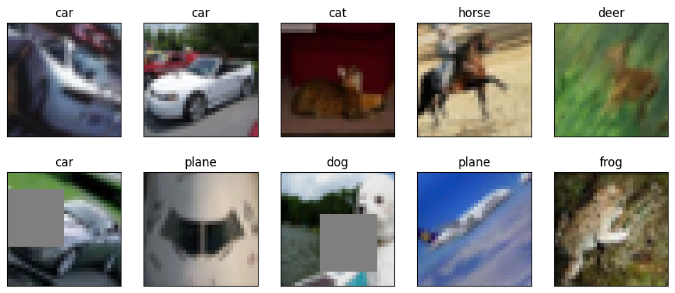

## Assignment Objectives  
1. works on CIFAR10 Dataset  
2. Has the architecture to C1C2C3C40 (No MaxPooling, but convolutions, where the last one has a stride of 2 instead) (NO restriction on using 1x1) (If you can figure out how to use Dilated kernels here instead of MP or strided convolution, then 200pts extra!)  
3. Total RF must be more than 44  
4. One of the layers must use Depthwise Separable Convolution  
5. One of the layers must use Dilated Convolution  
6. Use GAP (compulsory):- add FC after GAP to target #of classes (optional)  
7. Use albumentation library and apply:  
8. Horizontal flip  
9. ShiftScaleRotate  
10. coarseDropout (max_holes = 1, max_height=16px, max_width=16, min_holes = 1, min_height=16px, min_width=16px, fill_value=(mean  of your dataset), mask_fill_value = None)  
11. Achieve 85% accuracy, as many epochs as you want. Total Params to be less than 200k.  \

## Model Architecture  
----------------------------------------------------------------
        Layer (type)               Output Shape         Param #
================================================================
            Conv2d-1           [-1, 32, 16, 16]             864
       BatchNorm2d-2           [-1, 32, 16, 16]              64
              ReLU-3           [-1, 32, 16, 16]               0
            Conv2d-4           [-1, 32, 16, 16]             288
       BatchNorm2d-5           [-1, 32, 16, 16]              64
              ReLU-6           [-1, 32, 16, 16]               0
            Conv2d-7           [-1, 64, 16, 16]           2,048
       BatchNorm2d-8           [-1, 64, 16, 16]             128
              ReLU-9           [-1, 64, 16, 16]               0
           Conv2d-10             [-1, 64, 8, 8]             576
      BatchNorm2d-11             [-1, 64, 8, 8]             128
             ReLU-12             [-1, 64, 8, 8]               0
           Conv2d-13            [-1, 128, 8, 8]           8,192
      BatchNorm2d-14            [-1, 128, 8, 8]             256
             ReLU-15            [-1, 128, 8, 8]               0
           Conv2d-16            [-1, 128, 8, 8]           1,152
      BatchNorm2d-17            [-1, 128, 8, 8]             256
             ReLU-18            [-1, 128, 8, 8]               0
           Conv2d-19            [-1, 128, 8, 8]          16,384
      BatchNorm2d-20            [-1, 128, 8, 8]             256
             ReLU-21            [-1, 128, 8, 8]               0
           Conv2d-22            [-1, 128, 4, 4]           1,152
      BatchNorm2d-23            [-1, 128, 4, 4]             256
             ReLU-24            [-1, 128, 4, 4]               0
           Conv2d-25            [-1, 128, 4, 4]          16,384
      BatchNorm2d-26            [-1, 128, 4, 4]             256
             ReLU-27            [-1, 128, 4, 4]               0
           Conv2d-28            [-1, 128, 4, 4]           1,152
      BatchNorm2d-29            [-1, 128, 4, 4]             256
             ReLU-30            [-1, 128, 4, 4]               0
           Conv2d-31            [-1, 128, 4, 4]          16,384
      BatchNorm2d-32            [-1, 128, 4, 4]             256
             ReLU-33            [-1, 128, 4, 4]               0
           Conv2d-34            [-1, 128, 2, 2]           1,152
      BatchNorm2d-35            [-1, 128, 2, 2]             256
             ReLU-36            [-1, 128, 2, 2]               0
           Conv2d-37            [-1, 128, 2, 2]          16,384
      BatchNorm2d-38            [-1, 128, 2, 2]             256
             ReLU-39            [-1, 128, 2, 2]               0
           Conv2d-40            [-1, 128, 2, 2]           1,152
      BatchNorm2d-41            [-1, 128, 2, 2]             256
             ReLU-42            [-1, 128, 2, 2]               0
           Conv2d-43            [-1, 128, 2, 2]          16,384
      BatchNorm2d-44            [-1, 128, 2, 2]             256
             ReLU-45            [-1, 128, 2, 2]               0
           Conv2d-46            [-1, 128, 2, 2]           1,152
      BatchNorm2d-47            [-1, 128, 2, 2]             256
             ReLU-48            [-1, 128, 2, 2]               0
           Conv2d-49            [-1, 128, 2, 2]          16,384
      BatchNorm2d-50            [-1, 128, 2, 2]             256
             ReLU-51            [-1, 128, 2, 2]               0
           Conv2d-52            [-1, 128, 2, 2]           1,152
      BatchNorm2d-53            [-1, 128, 2, 2]             256
             ReLU-54            [-1, 128, 2, 2]               0
           Conv2d-55            [-1, 128, 2, 2]          16,384
      BatchNorm2d-56            [-1, 128, 2, 2]             256
             ReLU-57            [-1, 128, 2, 2]               0
           Conv2d-58            [-1, 128, 2, 2]           1,152
      BatchNorm2d-59            [-1, 128, 2, 2]             256
             ReLU-60            [-1, 128, 2, 2]               0
           Conv2d-61            [-1, 128, 2, 2]          16,384
      BatchNorm2d-62            [-1, 128, 2, 2]             256
             ReLU-63            [-1, 128, 2, 2]               0
AdaptiveAvgPool2d-64            [-1, 128, 1, 1]               0
           Linear-65                   [-1, 10]           1,290
================================================================
Total params: 158,282
Trainable params: 158,282
Non-trainable params: 0
----------------------------------------------------------------
Input size (MB): 0.01
Forward/backward pass size (MB): 1.71
Params size (MB): 0.60
Estimated Total Size (MB): 2.33
----------------------------------------------------------------  

## Sample Images after Transformations  
  

## Training Logs  
Epoch:  0 Learning Rate:  0.001

Train set: Average loss: 1.8875, Accuracy: 18137.0/50000 (36.27%)

Test set: Average loss: 0.0120, Accuracy: 21555/50000 (43.11%)

Epoch:  1 Learning Rate:  0.001

Train set: Average loss: 1.6617, Accuracy: 21352.0/50000 (42.70%)

Test set: Average loss: 0.0114, Accuracy: 23822/50000 (47.64%)

Epoch:  2 Learning Rate:  0.001

Train set: Average loss: 1.9099, Accuracy: 23172.0/50000 (46.34%)

Test set: Average loss: 0.0105, Accuracy: 25250/50000 (50.50%)

Epoch:  3 Learning Rate:  0.001

Train set: Average loss: 1.8356, Accuracy: 24595.0/50000 (49.19%)

Test set: Average loss: 0.0105, Accuracy: 25796/50000 (51.59%)

Epoch:  4 Learning Rate:  0.001

Train set: Average loss: 1.2563, Accuracy: 25677.0/50000 (51.35%)

Test set: Average loss: 0.0099, Accuracy: 27074/50000 (54.15%)

Epoch:  5 Learning Rate:  0.001

Train set: Average loss: 1.2659, Accuracy: 26380.0/50000 (52.76%)

Test set: Average loss: 0.0092, Accuracy: 28909/50000 (57.82%)

Epoch:  6 Learning Rate:  0.001

Train set: Average loss: 1.4817, Accuracy: 26976.0/50000 (53.95%)

Test set: Average loss: 0.0088, Accuracy: 29930/50000 (59.86%)

Epoch:  7 Learning Rate:  0.001

Train set: Average loss: 0.9410, Accuracy: 27757.0/50000 (55.51%)

Test set: Average loss: 0.0086, Accuracy: 30438/50000 (60.88%)

Epoch:  8 Learning Rate:  0.001

Train set: Average loss: 0.9880, Accuracy: 28064.0/50000 (56.13%)

Test set: Average loss: 0.0081, Accuracy: 31505/50000 (63.01%)

Epoch:  9 Learning Rate:  0.001

Train set: Average loss: 1.6917, Accuracy: 28731.0/50000 (57.46%)

Test set: Average loss: 0.0085, Accuracy: 30596/50000 (61.19%)

Epoch:  10 Learning Rate:  0.001

Train set: Average loss: 1.1883, Accuracy: 29253.0/50000 (58.51%)

Test set: Average loss: 0.0087, Accuracy: 30386/50000 (60.77%)

Epoch:  11 Learning Rate:  0.001

Train set: Average loss: 0.6445, Accuracy: 29516.0/50000 (59.03%)

Test set: Average loss: 0.0077, Accuracy: 32392/50000 (64.78%)

Epoch:  12 Learning Rate:  0.001

Train set: Average loss: 1.0633, Accuracy: 29995.0/50000 (59.99%)

Test set: Average loss: 0.0077, Accuracy: 32655/50000 (65.31%)

Epoch:  13 Learning Rate:  0.001

Train set: Average loss: 2.0515, Accuracy: 30227.0/50000 (60.45%)

Test set: Average loss: 0.0072, Accuracy: 33474/50000 (66.95%)

Epoch:  14 Learning Rate:  0.001

Train set: Average loss: 1.8769, Accuracy: 30668.0/50000 (61.34%)

Test set: Average loss: 0.0071, Accuracy: 34235/50000 (68.47%)

Epoch:  15 Learning Rate:  0.001

Train set: Average loss: 1.2066, Accuracy: 30830.0/50000 (61.66%)

Test set: Average loss: 0.0072, Accuracy: 33763/50000 (67.53%)

Epoch:  16 Learning Rate:  0.001

Train set: Average loss: 0.9744, Accuracy: 31328.0/50000 (62.66%)

Test set: Average loss: 0.0068, Accuracy: 34699/50000 (69.40%)

Epoch:  17 Learning Rate:  0.001

Train set: Average loss: 1.1349, Accuracy: 31382.0/50000 (62.76%)

Test set: Average loss: 0.0071, Accuracy: 33949/50000 (67.90%)

Epoch:  18 Learning Rate:  0.001

Train set: Average loss: 0.8847, Accuracy: 31695.0/50000 (63.39%)

Test set: Average loss: 0.0066, Accuracy: 34912/50000 (69.82%)

Epoch:  19 Learning Rate:  0.001

Train set: Average loss: 0.7443, Accuracy: 31867.0/50000 (63.73%)

Test set: Average loss: 0.0065, Accuracy: 35186/50000 (70.37%)

Epoch:  20 Learning Rate:  0.001

Train set: Average loss: 0.6304, Accuracy: 31903.0/50000 (63.81%)

Test set: Average loss: 0.0067, Accuracy: 35092/50000 (70.18%)

Epoch:  21 Learning Rate:  0.001

Train set: Average loss: 0.6261, Accuracy: 32371.0/50000 (64.74%)

Test set: Average loss: 0.0066, Accuracy: 34853/50000 (69.71%)

Epoch:  22 Learning Rate:  0.001

Train set: Average loss: 1.1169, Accuracy: 32489.0/50000 (64.98%)

Test set: Average loss: 0.0063, Accuracy: 35765/50000 (71.53%)

Epoch:  23 Learning Rate:  0.001

Train set: Average loss: 1.1446, Accuracy: 32854.0/50000 (65.71%)

Test set: Average loss: 0.0061, Accuracy: 36044/50000 (72.09%)

Epoch:  24 Learning Rate:  0.001

Train set: Average loss: 0.6383, Accuracy: 32935.0/50000 (65.87%)

Test set: Average loss: 0.0059, Accuracy: 36643/50000 (73.29%)

Epoch:  25 Learning Rate:  0.001

Train set: Average loss: 0.9809, Accuracy: 33183.0/50000 (66.37%)

Test set: Average loss: 0.0058, Accuracy: 36934/50000 (73.87%)

Epoch:  26 Learning Rate:  0.001

Train set: Average loss: 0.8161, Accuracy: 33193.0/50000 (66.39%)

Test set: Average loss: 0.0058, Accuracy: 37093/50000 (74.19%)

Epoch:  27 Learning Rate:  0.001

Train set: Average loss: 1.1170, Accuracy: 33360.0/50000 (66.72%)

Test set: Average loss: 0.0060, Accuracy: 36692/50000 (73.38%)

Epoch:  28 Learning Rate:  0.001

Train set: Average loss: 0.9087, Accuracy: 33602.0/50000 (67.20%)

Test set: Average loss: 0.0060, Accuracy: 36473/50000 (72.95%)

Epoch:  29 Learning Rate:  0.001

Train set: Average loss: 1.3801, Accuracy: 33602.0/50000 (67.20%)

Test set: Average loss: 0.0057, Accuracy: 37099/50000 (74.20%)

Epoch:  30 Learning Rate:  0.001

Train set: Average loss: 0.9790, Accuracy: 33888.0/50000 (67.78%)

Test set: Average loss: 0.0058, Accuracy: 37027/50000 (74.05%)

Epoch:  31 Learning Rate:  0.001

Train set: Average loss: 1.0841, Accuracy: 33802.0/50000 (67.60%)

Test set: Average loss: 0.0054, Accuracy: 37881/50000 (75.76%)

Epoch:  32 Learning Rate:  0.001

Train set: Average loss: 0.9815, Accuracy: 34052.0/50000 (68.10%)

Test set: Average loss: 0.0057, Accuracy: 37381/50000 (74.76%)

Epoch:  33 Learning Rate:  0.001

Train set: Average loss: 1.4668, Accuracy: 34360.0/50000 (68.72%)

Test set: Average loss: 0.0055, Accuracy: 37647/50000 (75.29%)

Epoch:  34 Learning Rate:  0.001

Train set: Average loss: 0.6642, Accuracy: 34382.0/50000 (68.76%)

Test set: Average loss: 0.0055, Accuracy: 37530/50000 (75.06%)

Epoch:  35 Learning Rate:  0.001

Train set: Average loss: 0.8315, Accuracy: 34500.0/50000 (69.00%)

Test set: Average loss: 0.0052, Accuracy: 38373/50000 (76.75%)

Epoch:  36 Learning Rate:  0.001

Train set: Average loss: 0.6158, Accuracy: 34524.0/50000 (69.05%)

Test set: Average loss: 0.0053, Accuracy: 38045/50000 (76.09%)

Epoch:  37 Learning Rate:  0.001

Train set: Average loss: 1.0821, Accuracy: 34682.0/50000 (69.36%)

Test set: Average loss: 0.0050, Accuracy: 38740/50000 (77.48%)

Epoch:  38 Learning Rate:  0.001

Train set: Average loss: 0.5123, Accuracy: 34673.0/50000 (69.35%)

Test set: Average loss: 0.0052, Accuracy: 38301/50000 (76.60%)

Epoch:  39 Learning Rate:  0.001

Train set: Average loss: 1.1845, Accuracy: 34808.0/50000 (69.62%)

Test set: Average loss: 0.0053, Accuracy: 38216/50000 (76.43%)

Epoch:  40 Learning Rate:  0.0001

Train set: Average loss: 0.7576, Accuracy: 35065.0/50000 (70.13%)

Test set: Average loss: 0.0045, Accuracy: 39788/50000 (79.58%)

Epoch:  41 Learning Rate:  0.0001

Train set: Average loss: 0.8476, Accuracy: 35488.0/50000 (70.98%)

Test set: Average loss: 0.0043, Accuracy: 40224/50000 (80.45%)

Epoch:  42 Learning Rate:  0.0001

Train set: Average loss: 0.4365, Accuracy: 35805.0/50000 (71.61%)

Test set: Average loss: 0.0043, Accuracy: 40353/50000 (80.71%)

Epoch:  43 Learning Rate:  0.0001

Train set: Average loss: 0.6246, Accuracy: 35687.0/50000 (71.37%)

Test set: Average loss: 0.0042, Accuracy: 40449/50000 (80.90%)

Epoch:  44 Learning Rate:  0.0001

Train set: Average loss: 1.2869, Accuracy: 35939.0/50000 (71.88%)

Test set: Average loss: 0.0042, Accuracy: 40527/50000 (81.05%)

Epoch:  45 Learning Rate:  0.0001

Train set: Average loss: 0.4998, Accuracy: 35993.0/50000 (71.99%)

Test set: Average loss: 0.0042, Accuracy: 40536/50000 (81.07%)

Epoch:  46 Learning Rate:  0.0001

Train set: Average loss: 0.8552, Accuracy: 36138.0/50000 (72.28%)

Test set: Average loss: 0.0041, Accuracy: 40742/50000 (81.48%)

Epoch:  47 Learning Rate:  0.0001

Train set: Average loss: 0.7574, Accuracy: 36133.0/50000 (72.27%)

Test set: Average loss: 0.0041, Accuracy: 40691/50000 (81.38%)

Epoch:  48 Learning Rate:  0.0001

Train set: Average loss: 0.5801, Accuracy: 36355.0/50000 (72.71%)

Test set: Average loss: 0.0040, Accuracy: 40914/50000 (81.83%)

Epoch:  49 Learning Rate:  0.0001

Train set: Average loss: 0.7527, Accuracy: 36033.0/50000 (72.07%)

Test set: Average loss: 0.0040, Accuracy: 41036/50000 (82.07%)

Epoch:  50 Learning Rate:  0.0001

Train set: Average loss: 1.1934, Accuracy: 36444.0/50000 (72.89%)

Test set: Average loss: 0.0040, Accuracy: 40996/50000 (81.99%)

Epoch:  51 Learning Rate:  0.0001

Train set: Average loss: 1.0439, Accuracy: 36288.0/50000 (72.58%)

Test set: Average loss: 0.0039, Accuracy: 41141/50000 (82.28%)

Epoch:  52 Learning Rate:  0.0001

Train set: Average loss: 0.9523, Accuracy: 36407.0/50000 (72.81%)

Test set: Average loss: 0.0039, Accuracy: 41211/50000 (82.42%)

Epoch:  53 Learning Rate:  0.0001

Train set: Average loss: 0.9845, Accuracy: 36437.0/50000 (72.87%)

Test set: Average loss: 0.0039, Accuracy: 41232/50000 (82.46%)

Epoch:  54 Learning Rate:  0.0001

Train set: Average loss: 0.3994, Accuracy: 36563.0/50000 (73.13%)

Test set: Average loss: 0.0039, Accuracy: 41175/50000 (82.35%)

Epoch:  55 Learning Rate:  0.0001

Train set: Average loss: 0.8896, Accuracy: 36575.0/50000 (73.15%)

Test set: Average loss: 0.0039, Accuracy: 41235/50000 (82.47%)

Epoch:  56 Learning Rate:  0.0001

Train set: Average loss: 0.5310, Accuracy: 36590.0/50000 (73.18%)

Test set: Average loss: 0.0038, Accuracy: 41418/50000 (82.84%)

Epoch:  57 Learning Rate:  0.0001

Train set: Average loss: 1.1179, Accuracy: 36623.0/50000 (73.25%)

Test set: Average loss: 0.0039, Accuracy: 41190/50000 (82.38%)

Epoch:  58 Learning Rate:  0.0001

Train set: Average loss: 0.6785, Accuracy: 36549.0/50000 (73.10%)

Test set: Average loss: 0.0038, Accuracy: 41342/50000 (82.68%)

Epoch:  59 Learning Rate:  0.0001

Train set: Average loss: 0.6172, Accuracy: 36735.0/50000 (73.47%)

Test set: Average loss: 0.0037, Accuracy: 41560/50000 (83.12%)

Epoch:  60 Learning Rate:  0.0001

Train set: Average loss: 0.7360, Accuracy: 36756.0/50000 (73.51%)

Test set: Average loss: 0.0037, Accuracy: 41549/50000 (83.10%)

Epoch:  61 Learning Rate:  0.0001

Train set: Average loss: 1.0994, Accuracy: 36796.0/50000 (73.59%)

Test set: Average loss: 0.0038, Accuracy: 41492/50000 (82.98%)

Epoch:  62 Learning Rate:  0.0001

Train set: Average loss: 0.6686, Accuracy: 36769.0/50000 (73.54%)

Test set: Average loss: 0.0037, Accuracy: 41607/50000 (83.21%)

Epoch:  63 Learning Rate:  0.0001

Train set: Average loss: 0.6879, Accuracy: 36714.0/50000 (73.43%)

Test set: Average loss: 0.0037, Accuracy: 41677/50000 (83.35%)

Epoch:  64 Learning Rate:  0.0001

Train set: Average loss: 0.7915, Accuracy: 36852.0/50000 (73.70%)

Test set: Average loss: 0.0037, Accuracy: 41643/50000 (83.29%)

Epoch:  65 Learning Rate:  0.0001

Train set: Average loss: 0.8825, Accuracy: 36899.0/50000 (73.80%)

Test set: Average loss: 0.0037, Accuracy: 41753/50000 (83.51%)

Epoch:  66 Learning Rate:  0.0001

Train set: Average loss: 0.5905, Accuracy: 37010.0/50000 (74.02%)

Test set: Average loss: 0.0037, Accuracy: 41683/50000 (83.37%)

Epoch:  67 Learning Rate:  0.0001

Train set: Average loss: 0.5510, Accuracy: 36979.0/50000 (73.96%)

Test set: Average loss: 0.0037, Accuracy: 41716/50000 (83.43%)

Epoch:  68 Learning Rate:  0.0001

Train set: Average loss: 0.5815, Accuracy: 36967.0/50000 (73.93%)

Test set: Average loss: 0.0036, Accuracy: 41777/50000 (83.55%)

Epoch:  69 Learning Rate:  0.0001

Train set: Average loss: 0.6601, Accuracy: 37061.0/50000 (74.12%)

Test set: Average loss: 0.0036, Accuracy: 41982/50000 (83.96%)

Epoch:  70 Learning Rate:  0.0001

Train set: Average loss: 0.8081, Accuracy: 37092.0/50000 (74.18%)

Test set: Average loss: 0.0035, Accuracy: 42004/50000 (84.01%)

Epoch:  71 Learning Rate:  0.0001

Train set: Average loss: 0.4771, Accuracy: 36953.0/50000 (73.91%)

Test set: Average loss: 0.0036, Accuracy: 41751/50000 (83.50%)

Epoch:  72 Learning Rate:  0.0001

Train set: Average loss: 1.0689, Accuracy: 37061.0/50000 (74.12%)

Test set: Average loss: 0.0036, Accuracy: 41861/50000 (83.72%)

Epoch:  73 Learning Rate:  0.0001

Train set: Average loss: 1.0380, Accuracy: 36922.0/50000 (73.84%)

Test set: Average loss: 0.0035, Accuracy: 42102/50000 (84.20%)

Epoch:  74 Learning Rate:  0.0001

Train set: Average loss: 0.6125, Accuracy: 37113.0/50000 (74.23%)

Test set: Average loss: 0.0035, Accuracy: 42191/50000 (84.38%)

Epoch:  75 Learning Rate:  0.0001

Train set: Average loss: 0.4459, Accuracy: 37185.0/50000 (74.37%)

Test set: Average loss: 0.0035, Accuracy: 42061/50000 (84.12%)

Epoch:  76 Learning Rate:  0.0001

Train set: Average loss: 0.6793, Accuracy: 37186.0/50000 (74.37%)

Test set: Average loss: 0.0035, Accuracy: 42127/50000 (84.25%)

Epoch:  77 Learning Rate:  0.0001

Train set: Average loss: 0.8778, Accuracy: 37214.0/50000 (74.43%)

Test set: Average loss: 0.0035, Accuracy: 42055/50000 (84.11%)

Epoch:  78 Learning Rate:  0.0001

Train set: Average loss: 1.1137, Accuracy: 37190.0/50000 (74.38%)

Test set: Average loss: 0.0035, Accuracy: 42234/50000 (84.47%)

Epoch:  79 Learning Rate:  0.0001

Train set: Average loss: 0.9828, Accuracy: 37215.0/50000 (74.43%)

Test set: Average loss: 0.0034, Accuracy: 42347/50000 (84.69%)

Epoch:  80 Learning Rate:  1e-05

Train set: Average loss: 0.4727, Accuracy: 37347.0/50000 (74.69%)

Test set: Average loss: 0.0034, Accuracy: 42404/50000 (84.81%)

Epoch:  81 Learning Rate:  1e-05

Train set: Average loss: 0.4327, Accuracy: 37362.0/50000 (74.72%)

Test set: Average loss: 0.0034, Accuracy: 42414/50000 (84.83%)

Epoch:  82 Learning Rate:  1e-05

Train set: Average loss: 0.6716, Accuracy: 37291.0/50000 (74.58%)

Test set: Average loss: 0.0034, Accuracy: 42373/50000 (84.75%)

Epoch:  83 Learning Rate:  1e-05

Train set: Average loss: 0.3923, Accuracy: 37184.0/50000 (74.37%)

Test set: Average loss: 0.0034, Accuracy: 42351/50000 (84.70%)

Epoch:  84 Learning Rate:  1e-05

Train set: Average loss: 0.3839, Accuracy: 37386.0/50000 (74.77%)

Test set: Average loss: 0.0034, Accuracy: 42428/50000 (84.86%)

Epoch:  85 Learning Rate:  1e-05

Train set: Average loss: 1.0912, Accuracy: 37305.0/50000 (74.61%)

Test set: Average loss: 0.0034, Accuracy: 42413/50000 (84.83%)

Epoch:  86 Learning Rate:  1e-05

Train set: Average loss: 0.3986, Accuracy: 37375.0/50000 (74.75%)

Test set: Average loss: 0.0034, Accuracy: 42473/50000 (84.95%)

Epoch:  87 Learning Rate:  1e-05

Train set: Average loss: 0.6430, Accuracy: 37292.0/50000 (74.58%)

Test set: Average loss: 0.0034, Accuracy: 42419/50000 (84.84%)

Epoch:  88 Learning Rate:  1e-05

Train set: Average loss: 0.5121, Accuracy: 37286.0/50000 (74.57%)

Test set: Average loss: 0.0034, Accuracy: 42441/50000 (84.88%)

Epoch:  89 Learning Rate:  1e-05

Train set: Average loss: 1.1993, Accuracy: 37363.0/50000 (74.73%)

Test set: Average loss: 0.0034, Accuracy: 42490/50000 (84.98%)

Epoch:  90 Learning Rate:  1e-05

Train set: Average loss: 0.8098, Accuracy: 37455.0/50000 (74.91%)

Test set: Average loss: 0.0034, Accuracy: 42492/50000 (84.98%)

Epoch:  91 Learning Rate:  1e-05

Train set: Average loss: 0.6502, Accuracy: 37409.0/50000 (74.82%)

Test set: Average loss: 0.0033, Accuracy: 42520/50000 (85.04%)

Epoch:  92 Learning Rate:  1e-05

Train set: Average loss: 1.2623, Accuracy: 37350.0/50000 (74.70%)

Test set: Average loss: 0.0033, Accuracy: 42499/50000 (85.00%)

Epoch:  93 Learning Rate:  1e-05

Train set: Average loss: 0.5784, Accuracy: 37274.0/50000 (74.55%)

Test set: Average loss: 0.0033, Accuracy: 42527/50000 (85.05%)

Epoch:  94 Learning Rate:  1e-05

Train set: Average loss: 0.6899, Accuracy: 37436.0/50000 (74.87%)

Test set: Average loss: 0.0034, Accuracy: 42460/50000 (84.92%)

Epoch:  95 Learning Rate:  1e-05

Train set: Average loss: 0.5950, Accuracy: 37365.0/50000 (74.73%)

Test set: Average loss: 0.0033, Accuracy: 42509/50000 (85.02%)

Epoch:  96 Learning Rate:  1e-05

Train set: Average loss: 0.4881, Accuracy: 37432.0/50000 (74.86%)

Test set: Average loss: 0.0033, Accuracy: 42557/50000 (85.11%)

Epoch:  97 Learning Rate:  1e-05

Train set: Average loss: 1.0169, Accuracy: 37452.0/50000 (74.90%)

Test set: Average loss: 0.0033, Accuracy: 42508/50000 (85.02%)

Epoch:  98 Learning Rate:  1e-05

Train set: Average loss: 0.7744, Accuracy: 37391.0/50000 (74.78%)

Test set: Average loss: 0.0033, Accuracy: 42576/50000 (85.15%)

Epoch:  99 Learning Rate:  1e-05

Train set: Average loss: 0.9136, Accuracy: 37436.0/50000 (74.87%)

Test set: Average loss: 0.0033, Accuracy: 42562/50000 (85.12%)

Finished Training
